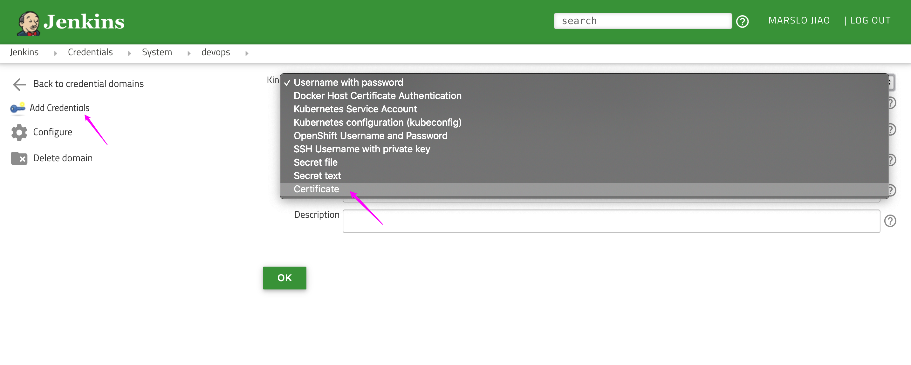
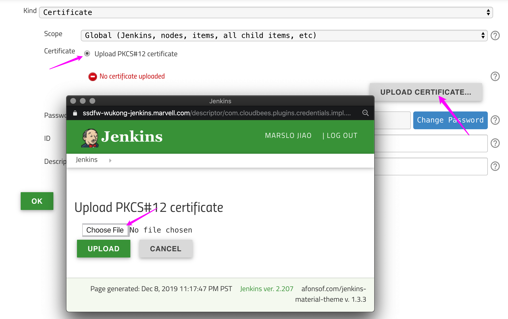
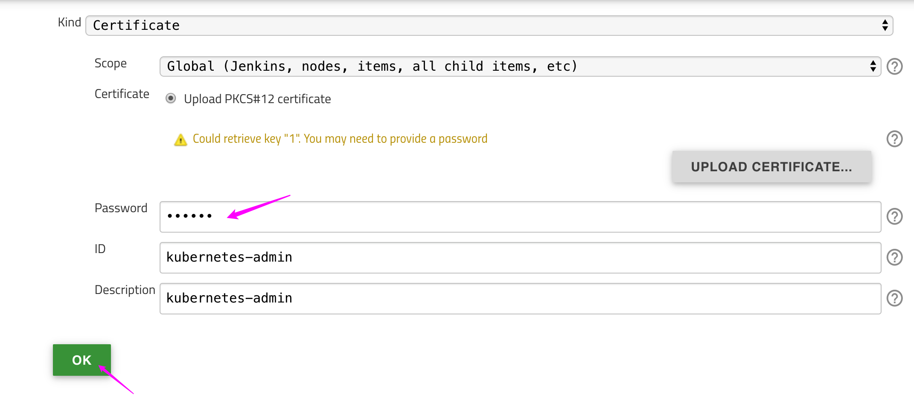
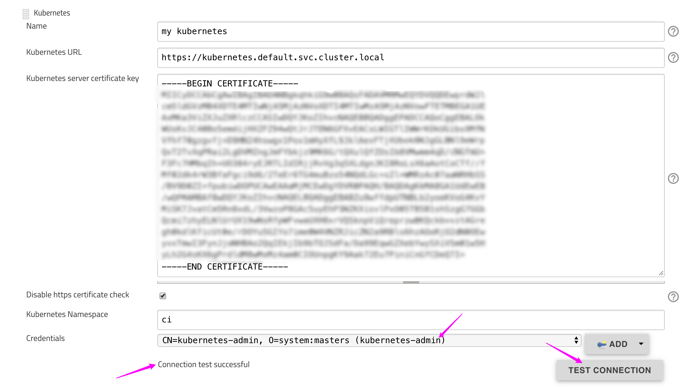
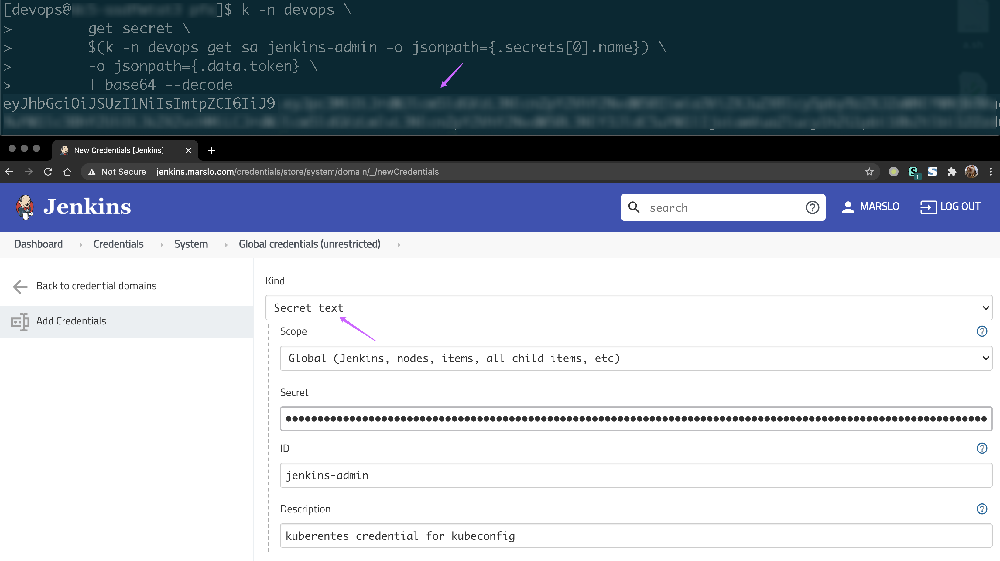
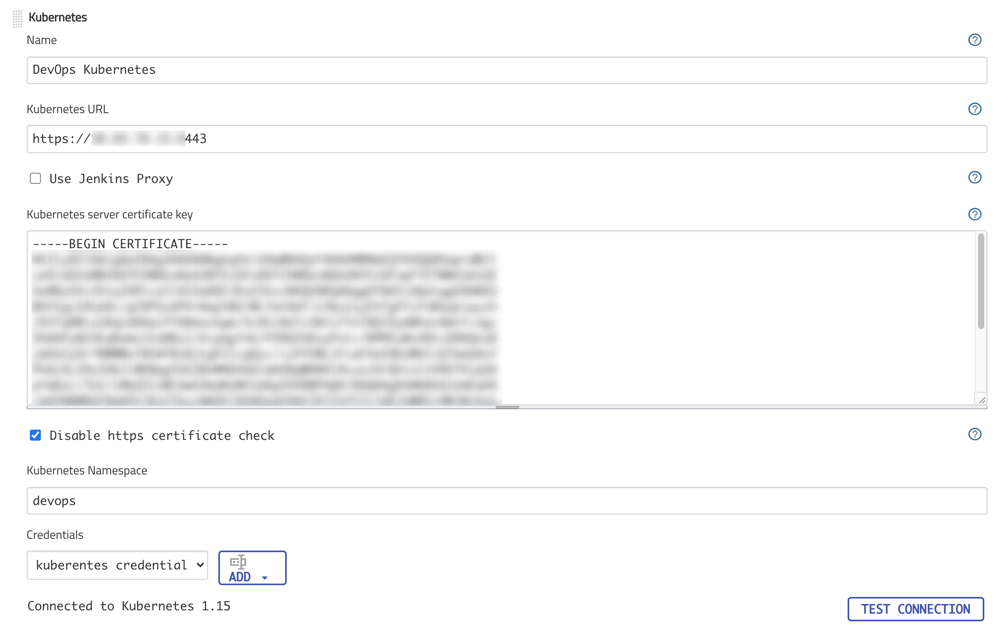

# kubernetes

**Table of Contents** _generated with_ [_DocToc_](https://github.com/thlorenz/doctoc)

* [namespace](kubernetes.md#namespace)
* [generate credentials for pfx](kubernetes.md#generate-credentials-for-pfx)
* [full steps](kubernetes.md#full-steps)
* [configure in jenkins](kubernetes.md#configure-in-jenkins)
* [using kubeconfig for remote cluster credential](kubernetes.md#using-kubeconfig-for-remote-cluster-credential)
* [Q&A](kubernetes.md#qa)

## namespace

### namespace

```bash
$ cat << EOF | k apply -f -
  ---
  apiVersion: v1
  kind: Namespace
  metadata:
    name: jenkins
EOF
namespace/jenkins created
```

### quota

```bash
$ cat << EOF | k apply -f -
  apiVersion: v1
  kind: ResourceQuota
  metadata:
    name: jenkins-quota
    namespace: jenkins
  spec:
    hard:
      requests.cpu: "16"
      requests.memory: 16Gi
      limits.cpu: "32"
      limits.memory: 32Gi
EOF
resourcequota/jenkins-quota edited
```

## generate credentials for pfx

### ca.crt

```bash
$ grep certificate-authority-data ~/.kube/config | awk -F': ' '{print $NF}' |  base64 -d > ca.crt
# OR
$ sudo cat /etc/kubernetes/pki/ca.crt
```

### client.crt & client.key

```bash
$ grep client-certificate-data ~/.kube/config | awk -F': ' '{print $NF}' |  base64 -d > client.crt
$ grep client-key-data ~/.kube/config | awk -F': ' '{print $NF}' |  base64 -d > client.key
```

### cert.pfx

```bash
$ openssl pkcs12 -export -out cert.pfx -inkey client.key -in client.crt -certfile ca.crt
Enter Export Password:
Verifying - Enter Export Password:

$ ls
ca.crt  cert.pfx  client.crt  client.key

# or

# using password 'marslo'
$ openssl pkcs12 -export -out cert.pfx -inkey client.key -in client.crt -certfile ca.crt -password pass:marslo
```

## full steps

```bash
$ cat ~/.kube/config \
      | grep certificate-authority-data \
      | awk '{print $2}' \
      | base64 -d > ca.crt
$ cat ~/.kube/config \
      | grep client-certificate-data \
      | awk '{print $2}' \
      | base64 -d > client.crt
$ cat ~/.kube/config \
      | grep client-key-data \
      | awk '{print $2}' \
      | base64 -d > client.key
$ openssl pkcs12 -export \
                 -out cert.pfx \
                 -in client.crt \
                 -inkey client.key \
                 -certfile ca.crt \
                 -password pass:devops
```

## configure in jenkins

* Go to `Manage Jenkins` -&gt; `Configure System` or `Manage Jenkins` -&gt; `Manage Nodes and Clouds` -&gt; `Configure Clouds`
* `Add a new Cloud` -&gt; `Kuberentes`
  * `Name`: 
  * `Kubernetes URL`:
    * get from `$ kubectl cluster-info`
    * using `https://kubernetes.default.svc.cluster.local`
  * `Kubernetes server certificate key`: content of `ca.crt`. \(`$ cat ca.crt`\)
  * `Credentials`:
    * `Add` -&gt; `Jenkins`
    * **Kind**: `Certificate`








* Setup in Jenkins



## using kubeconfig for remote cluster credential

> reference:
>
> * [jenkinsci/kubernetes-cli-plugin](https://github.com/jenkinsci/kubernetes-cli-plugin/blob/master/README.md#using-the-plugin-from-the-web-interface)
> * [Kubernetes Plugin: Authenticate with a ServiceAccount to a remote cluster](https://support.cloudbees.com/hc/en-us/articles/360038636511-Kubernetes-Plugin-Authenticate-with-a-ServiceAccount-to-a-remote-cluster)
> * [Creating a kubeconfig file for a self-hosted Kubernetes cluster](http://docs.shippable.com/deploy/tutorial/create-kubeconfig-for-self-hosted-kubernetes-cluster/)
> * [How to find your Jenkins admin password on Kubernetes](https://opensource.com/article/19/6/jenkins-admin-password-helm-kubernetes)

### get Kubernetes URL

```bash
$ k config view --minify | sed -n -re 's/^.*server: (https.*)$/\1/p'
```

* [or](https://gist.github.com/miry/9fbb8947510294c25285bda2a6e11900#gistcomment-2952487)

  ```bash
  $ k config view --minify --raw --output 'jsonpath={..cluster.server}'
  ```

### generate CA

```bash
$ k -n jenkins get secret \
              $(k -n jenkins get sa jenkins-admin -o jsonpath={.secrets[0].name}) \
              -o jsonpath={.data.'ca\.crt'} \
              | base64 --decode
```

* or

  ```bash
  $ cat ~/.kube/config \
        | grep certificate-authority-data \
        | awk '{print $2}' \
        | base64 -d > ca.crt
  ```

### Generate token in kubernetes


```bash
$ namespace='devops'
$ serviceAccount='jenkins-admin'
$ alias k='kubectl'
```


* setup sa

  ```bash
  $ k -n jenkins create sa jenkins-admin
  $ k -n jenkins create rolebinding jenkins-admin-binding \
                       --clusterrole=cluster-admin \
                       --serviceaccount=devops:jenkins-admin
  ```

* get token

  more info

  ```bash
  $ k get secret -n jenkins
  NAME                        TYPE                                  DATA   AGE
  default-token-8k7vj         kubernetes.io/service-account-token   3      27m
  jenkins-admin-token-9r8pt   kubernetes.io/service-account-token   3      21m

  $ k -n jenkins get rolebinding
  NAME                    AGE
  jenkins-admin-binding   15m
  $ k -n jenkins describe rolebinding jenkins-admin-binding
  Name:         jenkins-admin-binding
  Labels:       <none>
  Annotations:  <none>
  Role:
    Kind:  ClusterRole
    Name:  cluster-admin
  Subjects:
    Kind            Name           Namespace
    ----            ----           ---------
    ServiceAccount  jenkins-admin  jenkins

  $ k describe clusterrolebindings jenkins-admin-cluster-binding
  Name:         jenkins-admin-cluster-binding
  Labels:       <none>
  Annotations:  <none>
  Role:
    Kind:  ClusterRole
    Name:  cluster-admin
  Subjects:
    Kind            Name           Namespace
    ----            ----           ---------
    ServiceAccount  jenkins-admin  jenkins
  ```

  * [or](https://support.cloudbees.com/hc/en-us/articles/360038636511-Kubernetes-Plugin-Authenticate-with-a-ServiceAccount-to-a-remote-cluster)

    ```bash
    $ k -n jenkins \
        get secret \
        $(k -n jenkins get sa jenkins-admin -o jsonpath={.secrets[0].name}) \
        -o jsonpath={.data.token} \
        | base64 --decode
    ```

  * [or](https://stackoverflow.com/a/48853727/2940319)

### setup in Jenkins

* credential setup 
* cloud setup 

## Q&A

* [Kubernetes agents are failing with `SocketTimeoutException: connect timed out`](https://support.cloudbees.com/hc/en-us/articles/360038066231-Kubernetes-agents-are-failing-with-SocketTimeoutException-connect-timed-out-)
* [Message: pods is forbidden: User "system:serviceaccount:jenkins:jenkins-admin" cannot list resource "pods" in API group](https://github.com/helm/charts/issues/1092#issuecomment-303292037)

  > solution:
  >
  > * [lachie83/jenkins-service-account](https://gist.github.com/lachie83/17c1fff4eb58cf75c5fb11a4957a64d2)
  > * [see also](https://stackoverflow.com/a/59605326/2940319)
  > * [chukaofili/k8s-dashboard-admin-user.yaml](https://gist.github.com/chukaofili/9e94d966e73566eba5abdca7ccb067e6#file-k8s-dashboard-admin-user-yaml)

```bash
$ k -n <namespace> create rolebinding <sa>-binding \
                          --clusterrole=cluster-admin \
                          --serviceaccount=<namespace>:<sa>
$ k create clusterrolebinding jenkins-admin-cluster-binding \
                              --clusterrole cluster-admin \
                              --serviceaccount=<namespace>:jenkins-admin
```

* thinking

  ```bash
  $ k -n jenkins auth can-i list pods --as jenkins-admin
  no

  $ k -n jenkins auth can-i list pods --as jenkins-admin-binding
  no

  $ k -n jenkins auth can-i list pods --as jenkins-admin-cluster-binding
  no
  ```

